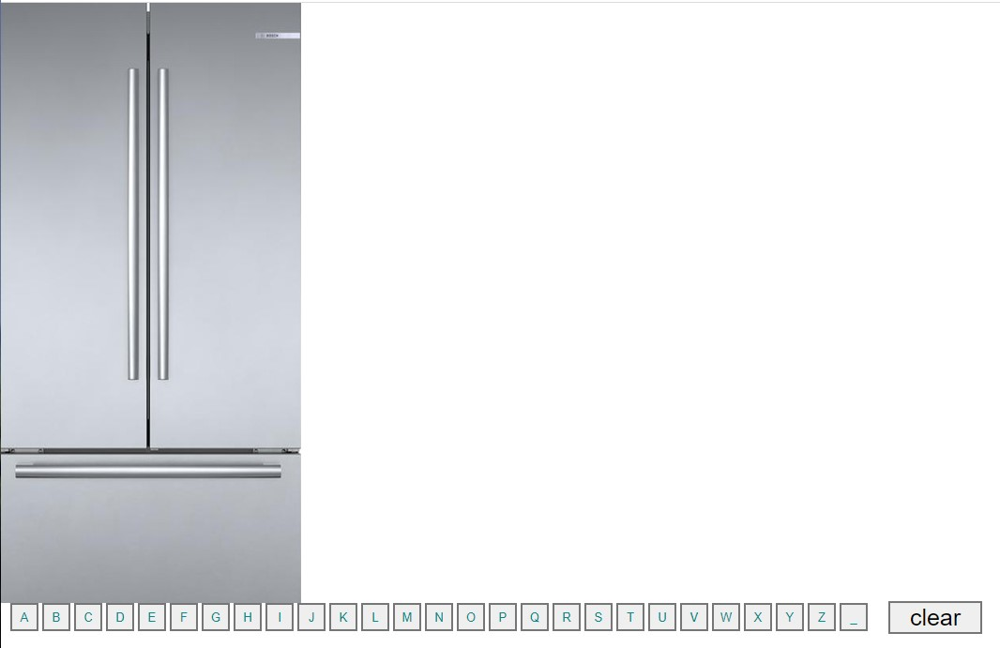

# FridgeMagnets
A cool class activity I wanted to redo and have for future reference on jquery fundamentals.  This shows all the basics of adding a for loop and then setting variables to the array using jquery.

[Fridge Magnets jquery] (https://macparthum.github.io/FridgeMagnets/)